# MyResume

## 📋 Proje Hakkında

Bu proje, ASP.NET Core 9.0 ve Entity Framework Core kullanılarak geliştirilmiş kişisel portfolio ve CV yönetim sistemidir. Uygulama, Code First yaklaşımıyla tasarlanmış olup Microsoft SQL Server veritabanı üzerinde çalışmaktadır.

Proje, ViewComponent mimarisi sayesinde modüler ve yeniden kullanılabilir UI bileşenleri sunar. Select.HtmlToPdf.NetCore entegrasyonu ile veritabanındaki bilgilerden otomatik PDF CV oluşturma özelliği bulunmaktadır. Admin paneli üzerinden dashboard istatistikleri, mesaj yönetimi ve tüm içerikler için tam CRUD işlemleri gerçekleştirilebilmektedir.

Admin Dashboard, StitchAI kullanılarak Tailwind CSS ile tasarlanmış modern ve kullanıcı dostu bir arayüze sahiptir ve Claude AI desteği sayesinde daha responsive ve optimize edilmiş bir kullanıcı deneyimi sunmaktadır.

Bu proje, ASP.NET Core MVC, Entity Framework Core ve modern web geliştirme prensipleri kullanılarak geliştirilmiş bir eğitim projesidir.

---

## 🛠️ Kullanılan Teknolojiler

# 📌 Backend
- ASP.NET Core 9.0
- ASP.NET Core MVC
- Entity Framework Core (Code First yaklaşımı)
- MS SQL Server
- Select.HtmlToPdf.NetCore (PDF oluşturma)
- Dependency Injection

# 📌 Frontend
- HTML5
- Tailwind CSS
- JavaScript

---

## 🖼️ Ekran Görüntüleri

### 📌 Ana Sayfa

  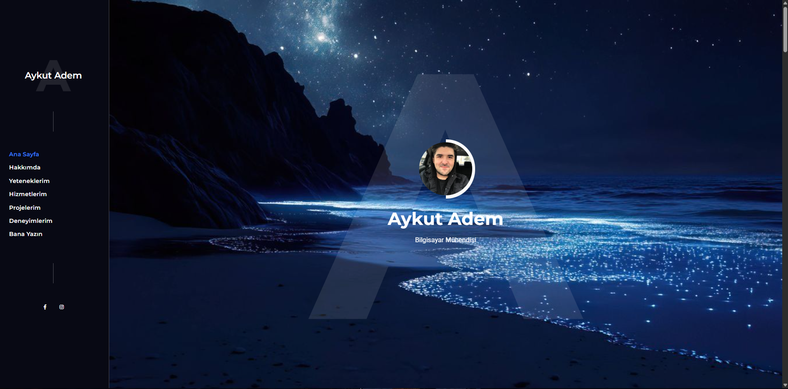
  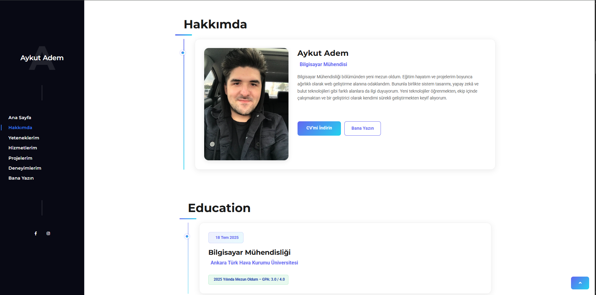
  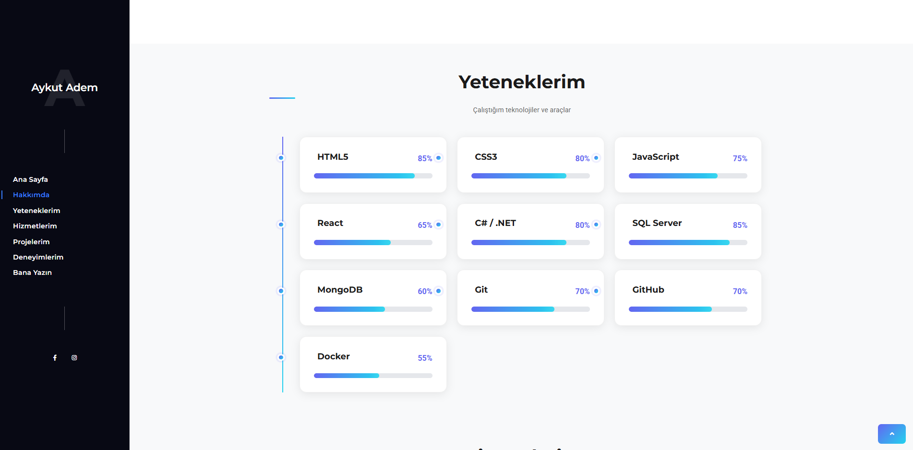
  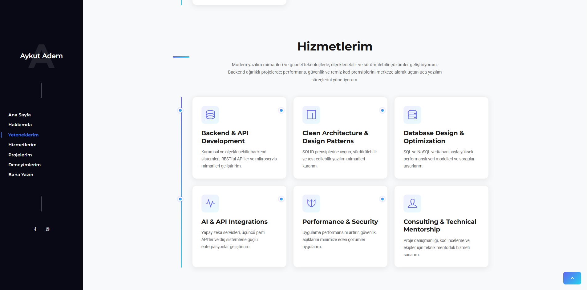
  
  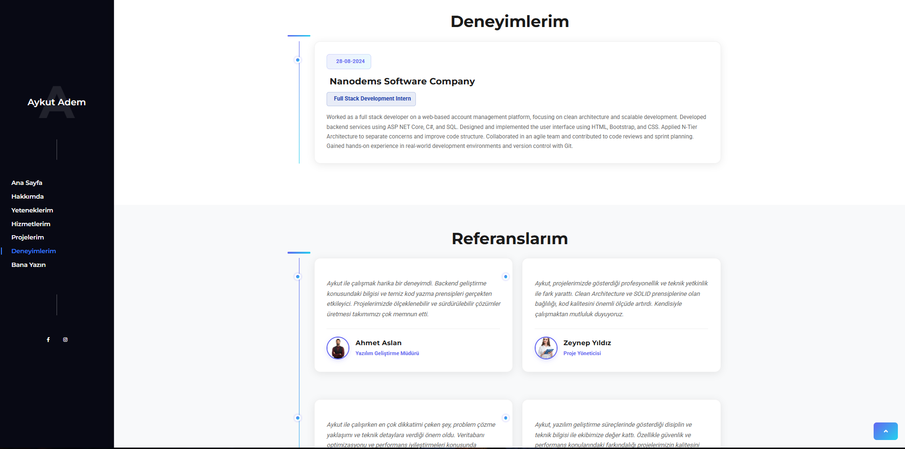
  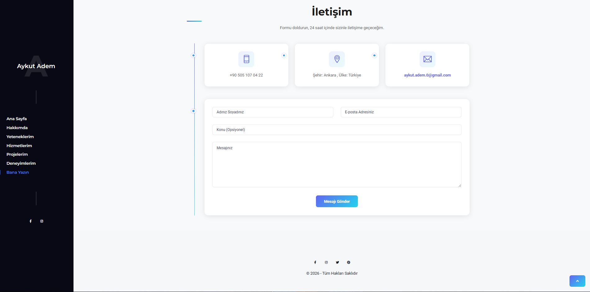

### 📌 Admin Paneli

  
  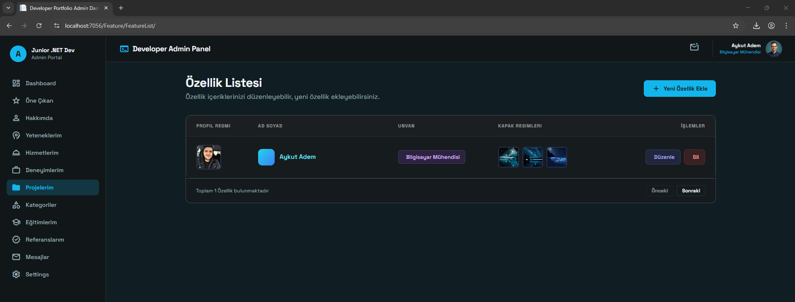
  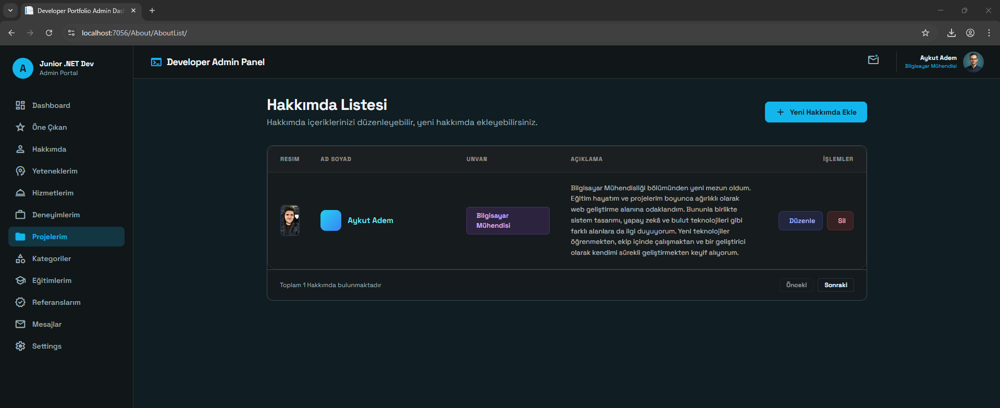
  
  
  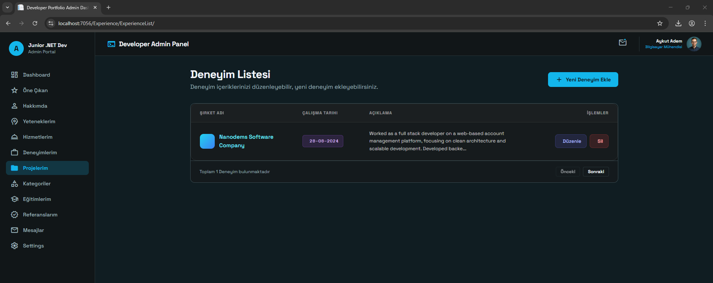
  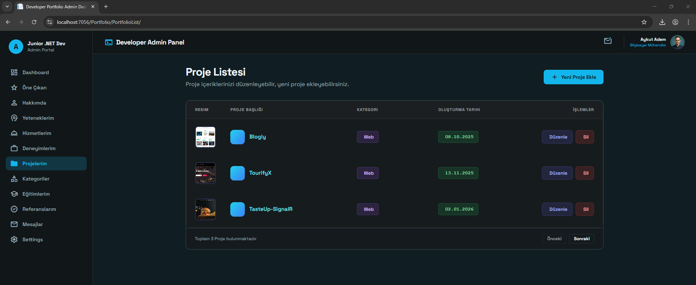
  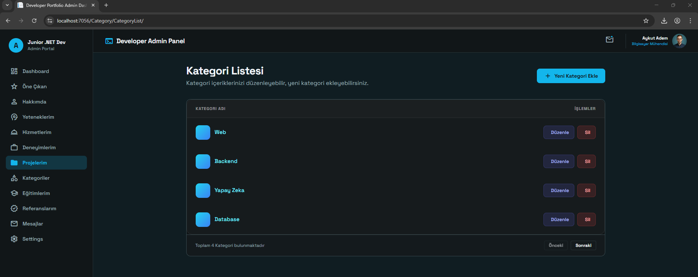
  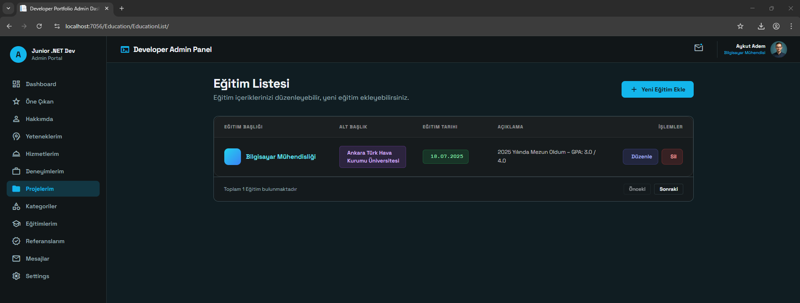

### 📌 Pdf Olarak İndirme

  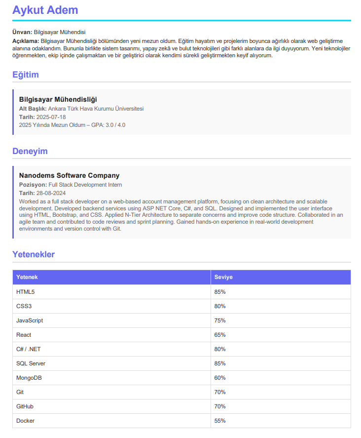

